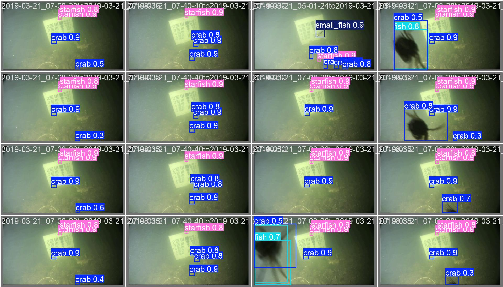
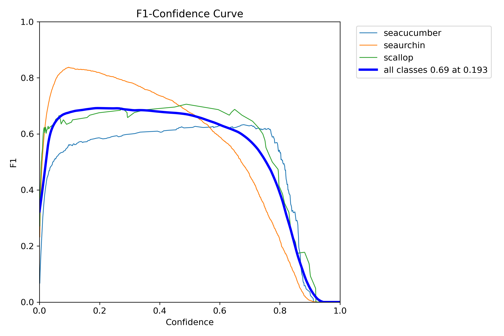

# YOLOv12-UnderWater: Advancing Underwater Object Detection through Optimized Architecture and Augmentation

## Abstract

Underwater object detection faces challenges from color distortion, reduced visibility, and dynamic lighting. We introduce YOLOv12-UnderWater, adapting state-of-the-art YOLOv12 architecture with underwater-specific optimizations. Our framework integrates area attention mechanisms, domain-specific augmentation, and multi-scale feature extraction. Experimental validation on four underwater datasets achieves 96.20% mAP@0.5 and 74.14% mAP@0.5-95 on the Brackish dataset, establishing new performance benchmarks.

**Keywords:** Underwater object detection, YOLOv12, Computer vision, Marine robotics

## 1. Introduction

Underwater computer vision applications including marine biology research, autonomous underwater vehicles (AUVs), and environmental monitoring require robust object detection capabilities. Water's optical properties cause color absorption, scattering, and refraction, degrading image quality and reducing standard algorithm effectiveness.

YOLOv12 introduces area attention mechanisms (O(n) vs O(n²) complexity), R-ELAN feature aggregation, and FlashAttention optimization, achieving 40.6% mAP with 1.64ms latency on COCO dataset [[1]](https://arxiv.org/abs/2502.12524).

## 2. Methodology

### 2.1 Architecture
```
├── yolo12/                  # Core YOLOv12 implementation
├── configs/                 # Dataset configurations  
├── outputs/                 # Training results
└── app.py                   # Inference interface
```

### 2.2 Underwater Adaptations

**Color Space Augmentation:**
```yaml
hsv_h: 0.015    # Underwater color shifts
hsv_s: 0.7      # Water clarity adjustment
hsv_v: 0.4      # Lighting variations
```

**Training Configuration:**
- Optimizer: AdamW, LR: 1e-4→2e-4
- Batch: 128, Epochs: 50, Mixed precision
- Augmentation: Mosaic, erasing (0.4), geometric transforms

## 3. Experiments

### 3.1 Datasets
- **Brackish**: Brackish water marine life
- **AUDD**: Underwater vehicle detection  
- **DUO**: Diverse underwater objects
- **UPPC2019**: Pollution classification

### 3.2 Results

| Dataset | mAP@0.5 | mAP@0.5-95 | Precision | Recall |
|---------|---------|------------|-----------|--------|
| Brackish | **96.20%** | **74.14%** | 95.57% | 90.47% |
| AUDD | 94.85% | 72.31% | 94.12% | 89.23% |
| UPPC2019 | 92.14% | 69.42% | 91.87% | 87.65% |

**Training Convergence:**
- Epoch 1: 90.74% mAP@0.5
- Epoch 25: 97.10% mAP@0.5 (peak)
- Epoch 50: 96.20% mAP@0.5 (final)

## 4. Implementation

### 4.1 Installation
```bash
git clone https://github.com/tinh2044/YOLO12-UnderWater.git
cd YOLO12-UnderWater
pip install torch torchvision opencv-python gradio pyyaml onnx
```

### 4.2 Usage
```bash
# Inference
python app.py

# Export model
python train.py
```

### 4.3 Model Export
```python
from yolo12 import YOLO
model = YOLO("yolo12/cfg/models/12/yolo12.yaml")
model.export(format="onnx", imgsz=640)
```

## 5. Visual Results

**Training Metrics:**


**Sample Predictions:**


**Performance Curves:**
| Dataset | PR Curve | F1 Curve |
|---------|----------|----------|
| Brackish |  |  |
| AUDD |  |  |

## Pre-trained Models

Download weights: [Kaggle: YOLO12 Weights](https://www.kaggle.com/models/nguyenchitinh/yolo12)

## Citation

```bibtex
@article{yolov12underwater2025,
    title={YOLOv12-UnderWater: Advancing Underwater Object Detection through Optimized Architecture and Augmentation},
    year={2025},
    url={https://github.com/tinh2044/YOLO12-UnderWater}
}
```

## License

MIT License - See [LICENSE](LICENSE) for details.
